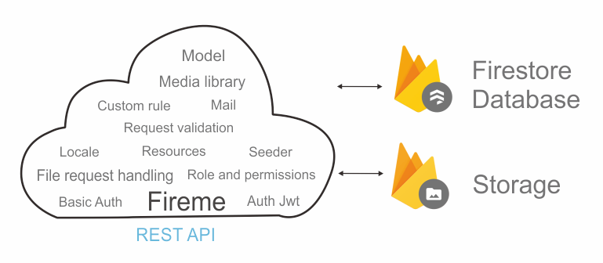

# Fireme

<center>
Boilerplate for nodejs. base on express js with Firebase.
</center>
<center style='margin-top:20px; margin-bottom:20px;'>

</center>

- ### Features

  - Model

    Create model via cli.

  - Media library

    Any model can own the media, and will able to save media, get media, and destroy media.
    Media stored to `Firebase Storage`.

  - File request handling

    Not worry about handling uploaded file, just upload from client side, and you can access file in request, `req.body.avatar`.

  - Request validation

    Determine if request passes the rule.
    You can create `custom rule` via cli.

  - Role and Permissions

    Binding to any model, any model can have a role and permissions, set role, checking access.

  - Resources

    Create custom resource from resources.

  - Auth - JWT

    Create token, re generate token, and set middleware authorization for certain routes.

  - Locale

    Enabled or disabled locale or just enabled on certain routes.

  - Mail

    create mail via cli, and send mail with html, file, or just text.

  - Firebase Cloud Messaging

    Sending push notification from server to client device.

  - Seeder

    Running seeder via cli.

- ### Live demo

  | Action        | Method | Auth   | Body             | EndPoint                                  |
  | ------------- | ------ | ------ | ---------------- | ----------------------------------------- |
  | Login         | POST   |        | email            | https://fireme.vercel.app/api/login       |
  |               |        |        | password         |                                           |
  |               |        |        |                  |                                           |
  | Register      | POST   |        | email            | https://fireme.vercel.app/api/register    |
  |               |        |        | name             |                                           |
  |               |        |        | password         |                                           |
  |               |        |        | confirm_password |                                           |
  |               |        |        |                  |                                           |
  | Token         | GET    |        |                  | https://fireme.vercel.app/api/token       |
  |               |        |        |                  |                                           |
  |               |        |        |                  |                                           |
  | Logout        | DELETE |        |                  | https://fireme.vercel.app/api/logout      |
  |               |        |        |                  |                                           |
  | Get User      | GET    | Bearer |                  | https://fireme.vercel.app/api/user        |
  |               |        | token  |                  |                                           |
  |               |        |        |                  |                                           |
  | Upload avatar | POST   | Bearer | avatar (file)    | https://fireme.vercel.app/api/user/avatar |
  |               |        | token  |                  |                                           |
  |               |        |        |                  |                                           |
  | Remove avatar | DELETE | Bearer |                  | https://fireme.vercel.app/api/user/avatar |
  |               |        | token  |                  |                                           |
  |               |        |        |                  |                                           |
  | Get Users     | GET    |        |                  | https://fireme.vercel.app/api/users       |
  |               |        |        |                  |                                           |

# Getting Started

- ### Clone

Clone this repo `https` or `SSH` and move to directory project and run `npm install`

```
   git clone git@github.com:Mamena2020/fireme.git

```

- ### Setup .env

After clone, you can create `.env` file from `.env.example`.

```
   cp .env.example .env

```

- ### Create firebase project

Create new Firebase project on <a href='https://console.firebase.google.com'>Firebase Console</a>.
After create firebase project, go to `project settings -> service accounts`, then generate new private key,
after download Service Account .json, convert to `base64 string`, then set to
`FIREBASE_SERVICE_ACCOUNT_BASE64` in the `.env` file, and then go to firebase `storage` and copy firebase bucket name and
set to `FIREBASE_STORAGE_BUCKET` in the `.env` file.

```
   FIREBASE_STORAGE_BUCKET=gs://your-project.appspot.com
   FIREBASE_SERVICE_ACCOUNT_BASE64= # base64 of firebaseServiceAccount.json

```

After setup firebase config then you ready to write the code.

# Model

- Create new model via cli.

```
   npx fireme make:model Product
```

The model will be created in the `models/Product.js` directory.

```

   import Model, { DataTypes } from '../core/model/Model.js';

   class Product extends Model {}

   Product.init({
    fields: {
        name: {
            type: DataTypes.string,
        },
        price: {
            type: DataTypes.number,
        },
        description: {
            type: DataTypes.string,
            nullable: true,
        },
    },
    collection: 'products',
    hasRole: false,
   });

   export default Product

```

- ### Store data

Stored data using `stored` static method. This method will return object that you save or null if failed.

```

   const data = {
      name: 'Macbook pro M1',
      price: 20000,
      description: 'Macbook pro chipset M1 16inch screen...',
   };

   const product = await Product.stored(data);

```

Bulk stored, stored many data at once. This `bulkStored` static method will return boolean true if success false if failed.

```

   const data = [
        {
           name: 'Macbook pro M1',
           price: 20000,
           description: 'Macbook pro chipset M1 16inch screen...',
        },
        {
           name: 'Macbook pro M2',
           price: 40000,
           description: 'Macbook pro chipset M2 14inch screen...',
        }
   ];

   const products = await Product.bulkStored(data);

```

- ### Update data

Update data using `update` method. This method will return true if success or false if failed.

```

    const product = await Product.findOne({
                        where: [{
                            field: 'id',
                            operator: Operator.equal,
                            value: id,
                        }],
                    });

   const newData = {
      price: 22000,
   };

   const updated = await product.update(newData);

```

Update many, using `update` static method. This method will return true if success or false if failed.

```
    const oldPrice = 20000;
    const newPrice = 22000;

    const updated = await Product.update({
            data: {
                price: newPrice,
            },
            where: [
                { field: 'price', operator: Operator.lte, value: oldPrice },
            ],
        });

```

- ### Delete data

Delete data using `destroy` method. This method will return true if success or false if failed.

```
    const product = await Product.findOne({
                        where: [{
                            field: 'id',
                            operator: Operator.equal,
                            value: id,
                        }],
                    });

    const deleted = await product.destroy();

```

Delete many data using `destroy` static method. This method required `where` condition, and will return true if success or false if failed.

```
    const deleted = await Product.destroy({
        where: [
                 { field: 'price', operator: Operator.lt, value: 20000 },
            ],
    });

```

- ### Get data

Get single data using `findOne` static method. This method required `where` condition will return object if success of null if failed.

```
    const product = await Product.findOne({
                        where: [{
                            field: 'id',
                            operator: Operator.equal,
                            value: id,
                        }],
                    });

```

Get many data using `findAll` static method. This method required `where` condition, and have optional parameter `limit`, and `orderBy`.
`orderBy` required 2 property `field` and `sort`, `sort` can be `asc` or `desc`.

```
    const products = await Product.findAll({
                        where: [{
                            field: 'price',
                            operator: Operator.gte,
                            value: 20000,
                        }],
                        limit: 10,
                        orderBy: {
                            field: "updated_at",
                            sort: "desc"
                        }
                    });

```

- ### Operators

```
    equal: '==',
    notEqual: '!=',
    lt: '<',
    lte: '<=',
    gt: '>',
    gte: '>=',
    arrayContains: 'array-contains',
    in: 'in',
    like: 'like',
    arrayContainsAny: 'array-contains-any',
    startsWith: 'startsWith',
    endsWith: 'endsWith',
    contains: 'contains',

```

- ### Noted

All model by default has `created_at` and `updated_at` property as timestamp.
to convert to datetime using `toDate()`.

```
    const product = await Product.findOne({
                        where: [{
                            field: 'id',
                            operator: Operator.equal,
                            value: id,
                        }],
                    });

    const productData = {
                          id: product.id,
                          name: product.name,
                          price: product.price,
                          created_at: product.created_at.toDate(),
                          updated_at: product.updated_at.toDate(),
                        }

```

# Media

Any model already has ability to save and get media.

- ### Save a file

Save file using `saveMedia` method. The method required file object and media name, and will return media object if success or null if failed.
If the instance already has a file with the same name, then the file will be replaced with a new file.

```
    const id = req.params.id;
    const { image } = req.body;

    const product = await Product.findOne({
                        where: [{
                            field: 'id',
                            operator: Operator.equal,
                            value: id,
                        }],
                    });

    const media = await product.saveMedia(image, 'thumbnail');

```

- ### Get media

Get all media by calling `instance.getMedia()`.

```

    const product = await Product.findOne({
                        where: [{
                            field: 'id',
                            operator: Operator.equal,
                            value: id,
                        }],
                    });

   product.getMedia() // return list of object

```

Get media by name, params is media name, will return media object if success and null if failed.

```
    product.getMedia('thumbnail') // return single object
    product.getMedia('thumbnail').url // return single object url

```

- ### Destroy media

Destroy media by calling `instance.destroyMedia(mediaName)`. This method will return true if success and false if failed.

```
    const product = await Product.findOne({
                        where: [{
                            field: 'id',
                            operator: Operator.equal,
                            value: id,
                        }],
                    });

   const deleted = await product.destroyMedia('thumbnail')

```

- ### Noted

All media files will be automatically deleted whenever `instance` of model is deleted.

# Request & Upload Files

Handling Content-Type header for

      - application/json
      - application/form-data
      - application/x-www-form-urlencoded

Handling all upload files on `POST` and `PUT` method, and nested fields.
- ### file properties

```
     // uploaded file will have this property
     name         // file name,
     encoding     // file encoding,
     type         // file mimeType,
     size         // file size,
     sizeUnit     // file size in bytes
     extension    // file extension
     tempDir      // file temporary directory

```

# Rule Validation

Create Request validation via cli.

```
   npx fireme make:request ProductRequest
```

The Request will be created in the `requests` directory.

```

   import RequestValidation from "../core/validation/RequestValidation.js"

   class ProductRequest extends RequestValidation {

       constructor(req) {
           super(req).load(this)
       }

        /**
        * Get the validation rules that apply to the request.
        *
        * @return object
        */
       rules() {
           return {

           }
       }
    }

    export default ProductRequest

```

- ### Basic usage.

```

   const valid = new ProductRequest(req)

   await valid.check()

   if (valid.isError)
      return valid.responseError(res) // or  return res.status(422).json(valid.errors)

```

- ### Example html form.

```

   <form action="endpoint" method="post" enctype="multipart/form-data">
      <div class="row justify-content-center d-flex">

         <div class="col-md-10">
             <label>Item</label>
             <input type="text" name="name" placeholder="name" />
             <input type="text" name="discount" placeholder="discount" />
             <input type="date" name="expired_date" placeholder="expired date" />
             <input type="file" name="product_image" placeholder="file" />
         </div>
         <div class="col-md-10">
             <label>Item 1</label>
             <input type="text" name="item[0][name]" placeholder="name" />
             <input type="text" name="item[0][description]" placeholder="description" />
             <input type="text" name="price[0]" placeholder="price " />
         </div>
         <div class="col-md-10 mt-5">
             <label>Item 2</label>
             <input type="text" name="item[1][name]" placeholder="name" />
             <input type="text" name="item[1][description]" placeholder="description" />
             <input type="text" name="price[1]" placeholder="price" />
         </div>
          <div class="col-md-10 mt-5">
             <input type="text" name="comments[]" />
             <input type="text" name="comments[]" />
             <input type="text" name="comments[]" />
         </div>
          <div class="col-md-10 mt-5">
             <input type="text" name="seo[title]" value="" placeholder="seo title" />
             <input type="text" name="seo[description][long]" value="" placeholder="seo long desc" />
             <input type="text" name="seo[description][short]" value="" placeholder="seo short desc" />
         </div>


         <div class="col-md-10 my-2 ">
             <button class="float-end btn btn-primary" type="submit">Submit</button>
         </div>

      </div>
   </form>

```

- ### Example rules.

```

   rules() {
     return {
         "name": {
             "rules": ["required"]
         },
         "discount": {
             "rules": ["required", "float", "min:3", "max:4"]
         },
         "expired_date": {
             "rules": ["required", "date", "date_after:now"]
         },
         "product_image": {
             "rules": ["required", "image", "max_file:1,MB"]
         },
         "item.*.name": {
             "rules": ["required"]
         },
         "item.*.description": {
             "rules": ["required"]
         },
         "price.*": {
             "rules": ["required", "float"]
         },
         "comments.*": {
             "rules": ["required"]
         },
         "seo.title": {
             "rules": ["required"]
         },
         "seo.description.long": {
             "rules": ["required"]
         },
         "seo.description.short": {
             "rules": ["required"]
         }
     }
   }

```

- ### Example error messages

```

   {
     "errors": {
          "name": [
            "The Name is required"
          ],
          "discount": [
            "The Discount is required",
            "The Discount must be valid format of float",
            "The Discount should be more or equal than 3",
            "The Discount should be less or equal than 4"
          ],
          "expired_date": [
            "The Expired date is required",
            "The Expired date must be valid format of date",
            "The Expired date date must be after the now's date"
          ],
          "product_image": [
            "The Product image is required"
          ],
          "item.0.name": [
            "The Item.0.name is required"
          ],
          "item.1.name": [
            "The Item.1.name is required"
          ],
          "item.0.description": [
            "The Item.0.description is required"
          ],
          "item.1.description": [
            "The Item.1.description is required"
          ],
          "price.0": [
            "The Price.0 is required",
            "The Price.0 must be valid format of float"
          ],
          "price.1": [
            "The Price.1 is required",
            "The Price.1 must be valid format of float"
          ],
          "comments.0": [
            "The Comments.0 is required"
          ],
          "comments.1": [
            "The Comments.1 is required"
          ],
          "comments.2": [
            "The Comments.2 is required"
          ]
          "seo.title": [
            "The Seo.title is required"
          ],
          "seo.description.long": [
            "The Seo.description.long is required"
          ],
          "seo.description.short": [
            "The Seo.description.short is required"
          ]
      }
   }

```

- ### Basic rules

  | Rule                 | Description                                 | Example                                                     |
  | -------------------- | ------------------------------------------- | ----------------------------------------------------------- |
  | required             | check empty value                           | "required"                                                  |
  | email                | check email formats                         | "email"                                                     |
  | match                | check match value with other value          | "match:password"                                            |
  | exists               | check value exists in the database          | "exists:users,email" or "exists:users,email,"+super.body.id |
  | unique               | check value is unique in database           | "unique:users,email" or "unique:users,email,"+super.body.id |
  | string               | check value is an string                    | "string"                                                    |
  | float                | check value is an float                     | "float"                                                     |
  | integer              | check value is an ineteger                  | "integer"                                                   |
  | max                  | count maximum value of numeric,             | "max:12"                                                    |
  |                      | if string/array its count the length        |                                                             |
  | min                  | count minimum value of numeric,             | "min:5"                                                     |
  |                      | if string/array its count the length        |                                                             |
  | date                 | check value is date format                  | "date"                                                      |
  | array                | check value is an array                     | "array"                                                     |
  | mimetypes            | check file mimetypes                        | "mimetypes:image/webp,image/x-icon,video/mp4"               |
  | mimes                | check file extension                        | "mimes:jpg,png,jpeg"                                        |
  | max_file             | check maximum file size,                    | "max_file:1,GB" or "max_file:1,MB" or "max_file:1,Byte"     |
  |                      | param can be `GB`, `MB`, `KB` or `Byte`     |                                                             |
  | image                | check file is an image format               | "image"                                                     |
  | date_after           | check value after particular date           | "date_after:now" or "date_after:birthdate"                  |
  |                      | param can be `now`, or other field name     |                                                             |
  | date_after_or_equal  | check value after or equal particular date  | "date_after_or_equal:now"                                   |
  |                      | param can be `now`, or other field name     |                                                             |
  | date_before          | check value before particular date          | "date_before:now" or "date_before:birthdate"                |
  |                      | param can be `now`, or other field name     |                                                             |
  | date_before_or_equal | check value before or equal particular date | "date_before_or_equal:now"                                  |
  |                      | param can be `now`, or other field name     |                                                             |
  | boolean              | check value is an boolean                   | "boolean"                                                   |
  | in_array             | check value exist in array                  | "in_array:1,3,4,1,4,5"                                      |
  | not_in_array         | check value is not include in array         | "not_in_array:1,3,4,1,4,5"                                  |
  | ip                   | check value is as ip address                | "ip"                                                        |
  | url                  | check value is as url                       | "url"                                                       |
  | json                 | check value is as json format               | "json"                                                      |
  | digits               | check value digits,                         | "digits:4"                                                  |
  | max_digits           | check maximum digits of value               | "max_digits:20"                                             |
  | min_digits           | check minumum digits of value               | "min_digits:20"                                             |
  | digits_between       | check digits bewteen of value               | "digits_between:5,10"                                       |

- ### Custom

Custom validation `messages` and `attribute`

```

    rules() {
        return {
                "name": {
                    "rules": ["required"],
                    "attribute": "Product name"
                },
                "discount": {
                    "rules": ["required", "float", "min:3", "max:4"],
                    "messages": {
                        "required": "The _attribute_ need discount",
                        "float": "The data must be numeric"
                    },
                    "attribute": "DISCOUNT"
                }
            }
    }

```

- ### Direct add error messages

```
    const valid = new ProductRequest(req)
    await valid.check()

    if (valid.isError)
    {
        valid.addError("name","Name have to .....")
        valid.addError("name","Name must be .....")


```

# Custom Rule

Create Custom Rule via cli.

```
   npx fireme make:rule GmailRule
```

The Rule will be created in the `rules` directory.

```
    class GmailRule  {

        constructor() {
        }

        /**
        * Determine if the validation rule passes.
        * @param {*} attribute
        * @param {*} value
        * @returns bolean
        */
        passes(attribute, value) {

            return value.includes("@gmail.com")
        }

        /**
        * Get the validation error message.
        *
        * @return string
        */
        message() {
            return 'The _attribute_ must be using @gmail.com'
        }
   }

   export default GmailRule

```

- ### Custom rule usage

```
    rules() {
        return {
                "email": {
                    "rules": [ new GmailRule, "required","email" ]
                }
            }
    }
```

- ### Noted

Default error messages outputs are dependent on the locale. If you haven't set up the locale as a middleware, it will be set to English `en` by default.

# Role and Permissions

A user model can have a role by set `hasRole` to true.

```

    User.init({
        fields: {
            name: {
                type: DataTypes.string,
            },
            email: {
                type: DataTypes.string,
            },
            password: {
                type: DataTypes.string,
            },
        },
        collection: 'users',
        hasRole: true, // set true
    });

```

- ### Set role

If the user instance already has a role, then the user role will be replaced with a new role. `instance.setRole(params)` params is role `name`. `setRole` will return status in boolean.

```


   const user = await User.stored({
      name: 'andre',
      emmail: 'andre@gmail.com',
      password: 'mypassword',
   });

   const status = await user.setRole('admin');

```

- ### Get role

Get role object by calling `instance.getRole()`, or direcly access role name `instance.getRole().name`.

```

   const role = user.getRole() // role object
   const roleName = user.getRole().name // role name


```

- ### Get permissions

Get permission by calling `instance.getRole().permissions` will get array of permissions name.

```
   const permissions = user.getRole().permissions; //  array of permissions name [ "user-create","user-stored"]

```

- Remove role

```
   const removed  = await user.removeRole();

```

- ### Check user access

Limitation user access using `gateAccess(userInstance,permissionNames)`, `permissionNames` must be an array of permission names.

```
    import gateAccess from '../core/service/RolePermission/RolePermissionService.js';

    if (!gateAccess(user, ["user-create","user-stored","user-access"]))
        return res.sendStatus(403); // return forbidden status code

```

- ### Add permissions

```
   import Permission from '../core/service/RolePermission/Permission.js';

   const permissions = [
       "user-create",
       "user-stored",
       "user-edit",
       "user-update",
       "user-delete",
       "user-search"
   ]

    for (let permission of permissions) {
        await Permission.stored({ name: permission })
    }

```

- ### Add Role

```

    import Role from '../core/service/RolePermission/Role.js';

    const roles = [ "admin","customer" ]

    for (let role of roles) {
        await Role.stored({ name: role })
    }

```

- ### Add Permissions to Role

Assign permissions to a role by using `roleInstance.assignPermissions(params)`, params can be a list of permissions `name` or `id`.

```
    const permissions = [
       "user-create",
       "user-stored"
    ]

    const roleAdmin = await Role.findOne({
                        where: [{
                            field: 'name',
                            operator: Operator.equal,
                            value: 'admin',
                        }],
                    });

    if (roleAdmin) {
        await roleAdmin.update({permissions: permissions})
    }

```

- ### Noted

There is no ref between permission and role, permission only stored all permission. The role has own field type an array to stored permission.

# Resource

Create new resource via cli.

```
   npx fireme make:resource UserResource
```

The Resource will be created in `resources/UserResource.js` directory.

```

   import Resource from "../core/resource/Resource.js"
   class UserResource extends Resource {
       constructor() {
           super().load(this)
       }

       /**
        * Transform the resource into custom object.
        *
        * @return
        */
       toArray(data) {
            return {}
       }
    }

    export default UserResource

```

- ### Basic usage

To create resources from a single object use `make` or `collection` for an array of objects.

```

     let userResource = new UserResource().make(user); // for single object

     let userResources = new UserResource().collection(users); // for array of object

```

- ### Example user resource

```

   class UserResource extends Resource {
       constructor() {
           super().load(this)
       }

       toArray(data) {
           return {
                     "id": data.id,
                     "name": data.name,
                     "email": data.email,
                     "image": data.getMedia("avatar")?.url || '',
                     "role": data.getRole()?.name || '',
                 }
       }
    }

```

- ### Example usage

```

    const user = await User.findOne({
                        where: [{
                            field: 'id',
                            operator: Operator.equal,
                            value: id,
                        }],
                    });

   const userResource = new UserResource().make(user);

   return res.json(userResource);

```

- ### Example result

```

   {
       "id": 'b96jRXfy8nSfZqk545SN',
       "name": 'Andre',
       "email": 'andre@gmail.com',
       "image": 'https://storage.googleapis.com/projectx.appspot.com/91ecb634-46dd-4fce-995c-b38d4eaa2bd1.jpeg',
       "role": 'admin',
   }

```

# Auth

- ### Create token

Create token by calling `JwtAuth.createToken()`, that will return `refreshToken` and `accessToken`.

```
   const payload = {
         id: user.id,
         name: user.name,
         email: user.email
     }

   const token = JwtAuth.createToken(payload)

   console.log(token.refreshToken)
   console.log(token.accessToken)


```

- ### Regenerate access token

Regenerate access token by calling `JwtAuth.regenerateAccessToken(refreshToken)`, that will return new access token.

```

   const accessToken = JwtAuth.regenerateAccessToken(refreshToken)

```

- ### Get Auth user

Get authenticated user by `calling JwtAuth.getUser(email)`, that will get user by email.

```

   const user = await JwtAuth.getUser(email)

```

Or you just setup the .env `AUTH_GET_CURRENT_USER_ON_REQUEST=true` and you can access current authenticated user by access
`req.user`. You can found the code where current user instance set to req.user in `core/middleware/JwtAuthPass.js` file.

```
    req.user = await JwtAuth.getUser(email);
```

Before using `JwtAuth.GetUser()`, ensure that you have set up your `User` model inside the `AuthConfig` in the `core/config/Auth.js` file. 

- Default user model for auth in `core/config/Auth.js`.

```
   class AuthConfig {

       /**
       * Default user model for auth
       * @returns
       */
       static user = User
```

It is crucial that your User model has a `email` field, as `JwtAuth.GetUser()` will retrieve the user instance based on the `email` by default. However, if you prefer to retrieve the current authenticated user in a different manner, you can modify the `JwtAuth.GetUser()` function to suit your needs in `core/auth/JwtAuth.js` file.


- ### Use Middleware - Auth jwt

For secure access to controller by adding `JwtAuthPass` to your router.

```
   import JwtAuthPass from '../core/middleware/JwtAuthPass.js';

   routerAuth.use(JwtAuthPass)
   routerAuth.get("/upload", UserController.upload)

   app.use("/api",routerAuth)

```

- ### Use Middleware - Basic auth

For secure access to controller by adding `BasicAuthPass` to your router.

```
   import BasicAuthPass from '../core/middleware/BasicAuthPass.js';

   routerAuth.use(BasicAuthPass)
   routerAuth.get("/upload", UserController.upload)

   app.use("/api",routerAuth)

```

Before using this, make sure already set username and password for basic auth in `.env` file.

```
    AUTH_BASIC_AUTH_USERNAME=myBasicUsername
    AUTH_BASIC_AUTH_PASSWORD=myBasicPassword
```

# Locale

- ### Config

Setup locale in `core/config/Locale.js`. by default locale setup to english `en`

```

    defaultLocale: "en",
    useLocale: useLocale,
    locales: ["en", "id"]

```

You can add more locale Code to `locales`. By default `locales` are only available for English `en`, and for Indonesia `id`.

- ### Default validation error Messages

After adding additional `locales`, it is important to update the validation error messages in the `core/locale/LangValidation.js` file, as the messages generated will depend on the selected locale.

```

   const langValidation = Object.freeze({
       required: {
           en: "The _attribute_ is required",
           id: "_attribute_ wajib di isi",
         //ja: "_attribute_ ........."  -> adding new validation messages for code ja
       },
       email: {
           en: "The _attribute_ must in E-mail format",
           id: "_attribute_ harus dalam format E-mail",
       },
       match: {
           en: "The _attribute_ must be match with _param1_",
           id: "_attribute_ harus sama dengan _param1_"
       },
       ......

```

- ### Use Locale

Its easy to use locale, just setup `.env` `LOCALE_USE=true`, then this will effect to `all` routes, so that have to has a params for locale, for the API router it should be `/api/:locale` and for the web router it should be `/:locale`.

```

   // example for api route
   const routerAuth = express.Router()

   routerAuth.use(JwtAuthPass)
   routerAuth.get("/user", UserController.getUser)
   routerAuth.post("/upload", UserController.upload)s

   app.use("/api/:locale", routerAuth)

   // http://localhost:5000/api/en/endpoint |  http://localhost:5000/api/id/endpoint

```

If you don't want to set the locale for all routes, only for a particular route, then simply set up the `.env` as `LOCALE_USE=false`. Then you can use the `LocalePass` middleware directly to your route.

```
   import LocalePass from '../core/middleware/LocalePass.js';

   // example for web route
   app.get("/:locale",LocalePass, (req, res) => {

   // http://localhost:5000/en | http://localhost:5000/id


   // example for api route
   app.get("/api/:locale/login",LocalePass, (req, res) => {

   // http://localhost:5000/api/en/login | http://localhost:5000/api/id/login

```

- ### Noted

All routers that using `LocalePass` will have the locale Code on `req`, accessible via `req.locale`.

# Mail

Create mail via cli.

```
   npx fireme make:mail AccountVerify
```

The mail will be created in the `mails` directory, with `examplefile.txt` and `template.ejs`

```

   import Mail from "../../core/mail/Mail.js"

   class AccountVerify extends Mail {
         constructor(from = String, to = [], subject = String) {
             super().load({
                 from: from,
                 to: to,
                 subject: subject,
                 text: "Just need to verify that this is your email address.",
                 attachments: [
                     {
                         filename: "theFile.txt",
                         path: "mails/AccountVerify/examplefile.txt"
                     },
                 ],
                 html: {
                     path: "mails/AccountVerify/template.ejs",
                     data: {
                         title: "Welcome to the party!",
                         message: "Just need to verify that this is your email address."
                     }
                 },
             })
         }
   }

   export default AccountVerify

```

The `template.ejs` using express view engine `ejs` to render html into mail content.

```
   <!DOCTYPE html>
     <html lang="en">
     <head>
         <meta charset="UTF-8">
         <meta http-equiv="X-UA-Compatible" content="IE=edge">
         <meta name="viewport" content="width=device-width, initial-scale=1.0">
         <title>
             <%= title %>
         </title>
     </head>
     <body>
         <h3>Hello!</h3>
         <p>
             <%= message %>
         </p>
         <p>
             Regards.
         </p>
         <p>
             fireme
         </p>
     </body>
   </html>

```

To use this `template.ejs`, you need to add an `html` object with a `path` and `data` (if needed) into `super().load()` method.

```
   html: {
            path: "mails/AccountVerify/template.ejs", // path is required
            data: // data is optional base on your template.ejs
            {
                title: "Welcome to the party!",
                message: "Just need to verify that this is your email address."
            }
        }
```

- ### Basic usage

To send email by calling `instance.send()`

```
   const sendMail = new AccountVerify("from@gmail.com",["receiver@gmail.com"],"Verify Account")

   await sendMail.send()

```

- ### Send file

To send files, you need to add an `attachments` to `super().load()`. See full <a href="https://nodemailer.com/message/attachments/">doc</a>.

```
   attachments: [
                     {
                         filename: "theFile.txt",
                         path: "mails/AccountVerify/examplefile.txt"
                     }
                ]

```

- ### Mail message options

Message options that you can add into `super().load()`.

| Name         | Description                                                                                                                          | Type   | Required |
| ------------ | ------------------------------------------------------------------------------------------------------------------------------------ | ------ | -------- |
| from         | The e-mail address of the sender. All e-mail addresses can be plain 'sender@server.com'                                              | string | `Yes`    |
| to           | Recipients e-mail addresses that will appear on the To                                                                               | array  | `Yes`    |
| subject      | Subject of the e-mail                                                                                                                | string | No       |
| text         | If you are using HTML for the body of the email, then this text will not be used again                                               | string | No       |
| html         | The HTML version of the message                                                                                                      | object | No       |
| attachments  | An array of objects is used for the purpose of sending files. See full <a href="https://nodemailer.com/message/attachments/">doc</a> | array  | No       |
| cc           | Recipients e-mail addresses that will appear on the Cc                                                                               | array  | No       |
| bcc          | Recipients e-mail addresses that will appear on the Bcc                                                                              | array  | No       |
| sender       | E-mail address that will appear on the Sender                                                                                        | string | No       |
| replyTo      | An array of e-mail addresses that will appear on the Reply-To                                                                        | array  | No       |
| alternatives | An array of alternative text contents. See full <a href="https://nodemailer.com/message/alternatives/">doc</a>                       | array  | No       |
| encoding     | optional transfer encoding for the textual parts.                                                                                    | string | No       |

- ### Noted

Before using mail, make sure you already setup `.env` file.

```
   MAIL_HOST= #example: smtp.gmail.com | smtp-relay.sendinblue.com
   MAIL_PORT=587
   MAIL_USERNAME=
   MAIL_PASSWORD=

```

# Firebase Cloud Messaging

- ### Send message

```
   import FirebaseCore from '../core/firebase/FirebaseCore.js';

   const message = {
        title: "Notification", // notification title
        body: "Hello there",   // notification body
        data: {
                               // payload
        },
        registrationTokens: ["token1","token2"] // target token
   }

   await FirebaseCore.sendMessage(message)

```

- ### Noted

Before using FCM, make sure you already `enable` Firebase Cloud Messaging API on <a href="https://console.cloud.google.com/">Google Cloud Console</a>, by selecting your project and navigating to `APIs & Services`. Once you have enabled the API, you can set up your .env file.

```
   FIREBASE_CLOUD_MESSAGING_SERVER_KEY= #fcm server key

```

# Seeder

- ### Running seeder

Running seeder via cli

```
    npx fireme seed:run
```

You can put your seeder code inside `seeder` function in the `core/seeder/Seeder.js` file

```

   const seeder = async () => {

         // put seeder code here..

   }

```

# Cors

The configuration for Cross-Origin Resource Sharing (CORS) can be found in the `core/config/Cors.js` file.
